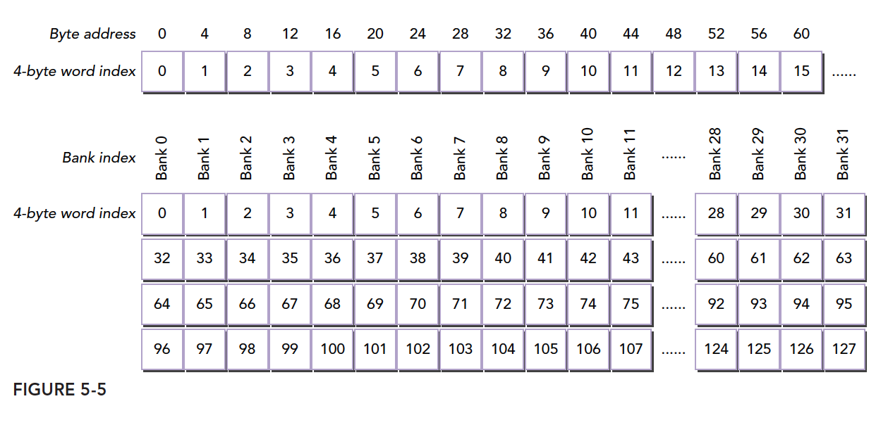
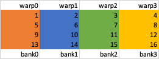

## Bank Conflict


## 什么是bank


cuda给出的关于shared memory及bank的介绍：

> Shared memory has 32 banks that are organized such that successive 32-bit words map to successive banks. Each bank has a bandwidth of 32 bits per clock cycle.

**SM执行流程：**

- SM调度单位为一个warp（一个warp内32个Thread）
- shared memory可以 被一个warp中的所有（32个）线程进行访问

## Bank和share memory的关系

**Shared Memory到Bank的映射方式：**


对shared memory访问addr的逻辑地址，实际映射到BankIndex为：

```
BankIndex = (addr/BankSize)%BankNum(32)
```

以`BankSize==4`为例：




## 什么是Conflict


## 案例：

假设shared memory存在下面的矩阵，取`WarpSize==4, BankSize==4, BankNum=4`


- 逐行读取：SM在调度过程中，每个wrap读取bank的关系如下，`warp0`四个线程挨个读取bank0-bank3的数据


- 逐列读取：SM在调度过程中，每个wrap读取bank的关系如下，`warp0`四个线程挨个读取bank0的数据，此时bank conflict存在



在shared memory上对数据Padding一列:


- 逐行读取：wrap0-3的读取按颜色划分，红颜色`X`数据为pad的无效数据，不会访问。每个wrap行访问没有bankconflict


- 逐列读取：同上，由于无效数据把连续数据在bank中错开，列访问也不会出现bank conflict

