### naive

```c
__global__ void matmulNaive(float* A, float* B, float* C, int M, int N, int K) {
  int i = threadIdx.y + blockIdx.y * blockDim.y;
  int j = threadIdx.x + blockIdx.x * blockDim.x;
  
  if (i < M && j < N) {
    float sum = 0;
    for (int k = 0; k < K; ++k) {
      sum += A[i * M + k] * B[k * N + j];
    }
    C[i * M + j] = sum;
  }
}
```

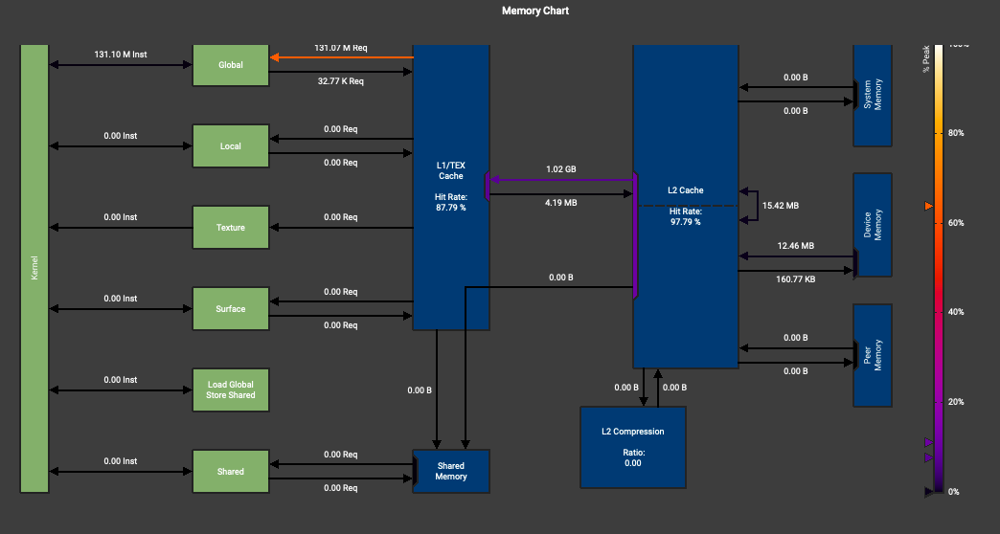

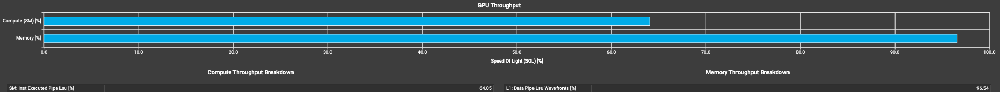

由于全部是global memory访问，所以并没有bank conflict

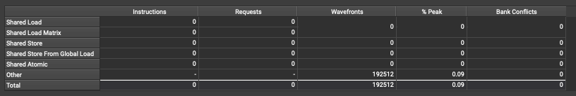

### shared memory

```c
__global__ void matmulShared(float* A, float* B, float* C, int M, int N, int K) {
  int i = threadIdx.y + blockIdx.y * blockDim.y;
  int j = threadIdx.x + blockIdx.x * blockDim.x;
  int bi = threadIdx.x;
  int bj = threadIdx.y;
  
  if (i < M && j < N) {
    float sum = 0;
    __shared__ float shareA[BLOCK_SIZE][BLOCK_SIZE];
    __shared__ float shareB[BLOCK_SIZE][BLOCK_SIZE];
    for (int k = 0; k < K; k+=BLOCK_SIZE) {
      shareA[bi][bj] = A[i * M + k];
      shareB[bj][bi] = B[k * N + j];
      __syncthreads();
      for (int inner = 0; inner < BLOCK_SIZE; ++inner) {
        sum += shareA[bi][inner] * shareB[bj][inner];
      }
      __syncthreads();
    }
    C[i * M + j] = sum;
  }
}
```

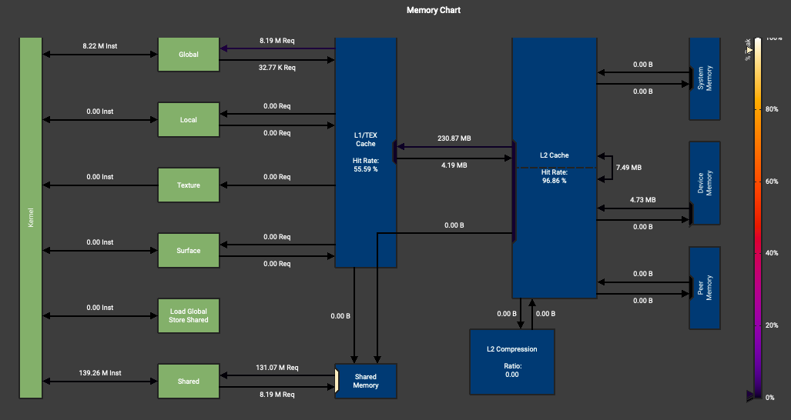

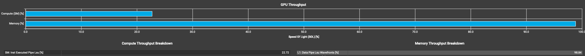

这里存在的性能问题是bank conflict太多，虽然使用了shared memory，但性能反而下降更多。

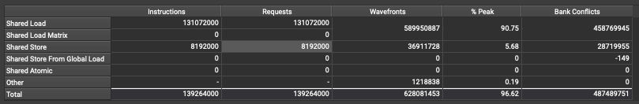

### bank conflict

```c
__global__ void matmulBankOpt(float* A, float* B, float* C, int M, int N, int K) {
  int i = threadIdx.y + blockIdx.y * blockDim.y;
  int j = threadIdx.x + blockIdx.x * blockDim.x;
  int bi = threadIdx.x;
  int bj = threadIdx.y;
  
  if (i < M && j < N) {
    float sum = 0;
    __shared__ float shareA[BLOCK_SIZE][BLOCK_SIZE];
    __shared__ float shareB[BLOCK_SIZE][BLOCK_SIZE];
    for (int k = 0; k < K; k+=BLOCK_SIZE) {
      shareA[bj][bi] = A[i * M + k];
      shareB[bi][bj] = B[k * N + j];
      __syncthreads();
      for (int inner = 0; inner < BLOCK_SIZE; ++inner) {
        sum += shareA[inner][bi] * shareB[inner][bj];
      }
      __syncthreads();
    }
    C[i * M + j] = sum;
  }
}
```

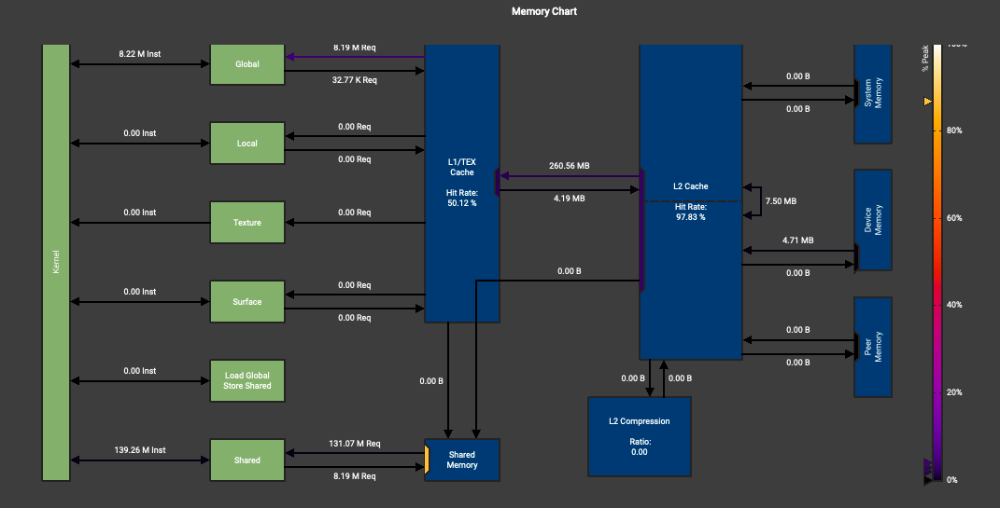

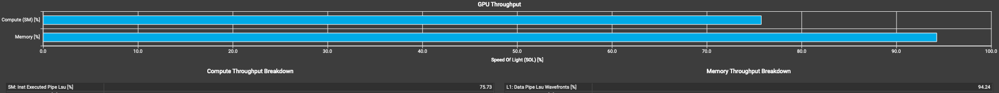

转置shared memory存储方式之后，load存在的bank conflict大幅解决，store还有问题.

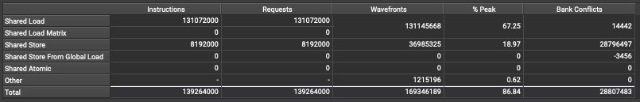

### bank conflict2

```c
__global__ void matmulBankOpt2(float* A, float* B, float* C, int M, int N, int K) {
  int i = threadIdx.y + blockIdx.y * blockDim.y;
  int j = threadIdx.x + blockIdx.x * blockDim.x;
  int bi = threadIdx.x;
  int bj = threadIdx.y;
  
  if (i < M && j < N) {
    float sum = 0;
    __shared__ float shareA[BLOCK_SIZE][BLOCK_SIZE];
    __shared__ float shareB[BLOCK_SIZE][BLOCK_SIZE + 1];
    for (int k = 0; k < K; k+=BLOCK_SIZE) {
      shareA[bj][bi] = A[i * M + k];
      shareB[bi][bj] = B[k * N + j];
      __syncthreads();
      for (int inner = 0; inner < BLOCK_SIZE; ++inner) {
        sum += shareA[inner][bi] * shareB[inner][bj];
      }
      __syncthreads();
    }
    C[i * M + j] = sum;
  }
}
```

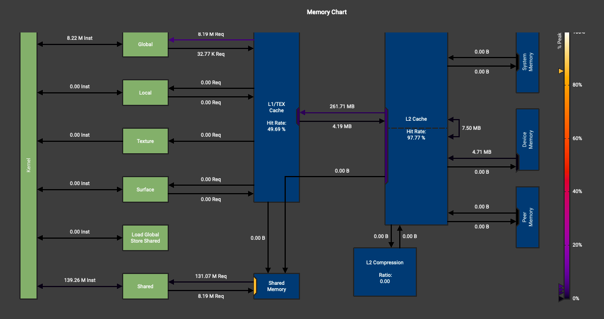

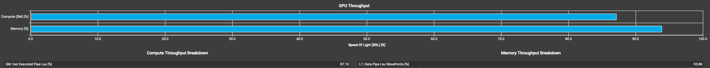

在`shareB`变量补了pad后，store操作的bank conflict大幅降低，但仍然存在较多的bank conflict(TODO).

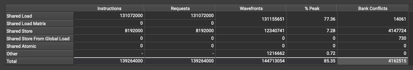